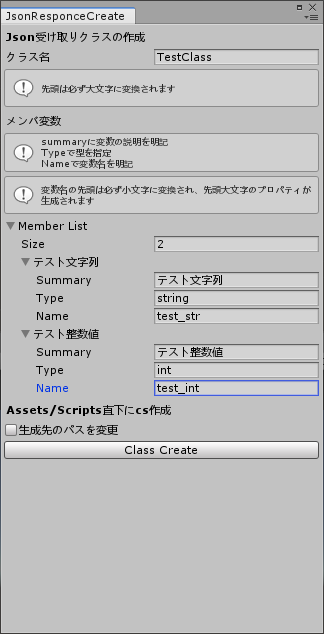

# JsonParseClassCreatorInUnity
UnityでJsonをパースするクラスを自動生成するエディター拡張
## 使い方
1. 画面上部のメニューからJSON/ParseScriptCreatorを選択
2. 表示されたwidowに必要な情報を入力
3. 生成するクラス名を入力（先頭文字は必ず大文字に変換されます）
4. メンバ変数をList上で追加
5. Summaryに変数の説明を入力（空欄でも可）
6. Typeに変数の型を入力
7. Nameに変数名を入力<br>（先頭文字が小文字に変換されたprivate変数が作成され、先頭文字が大文字に変換されたpublicなgetのみのプロパティが作成されます）<br>
（プロパティが作成される際、"_"は除外され次の文字が大文字に変換されます）
8. 生成するパスをAsset/Scripts以外にする場合は「生成先のパスを変更」にチェックを入れ独自のパスを入力してください
9. Class Createボタンを押下するとスクリプトファイルが生成されます

## 生成スクリプト例
入力データ<br>
<br>
TestClass.cs
```
using System.Collections;
using System.Collections.Generic;
using UnityEngine;

[System.Serializable]
public class TestClass {
/// <summary>
/// テスト文字列
/// </summary>
[SerializeField, HideInInspector]
private string test_str = default;
public string TestStr => test_str;

/// <summary>
/// テスト整数値
/// </summary>
[SerializeField, HideInInspector]
private int test_int = default;
public int TestInt => test_int;

}
```

## Script
[JsonParseClassCreatorInUnity/JsonParseClassCreator2/Assets/Editor/JsonResponceCreate.cs](https://github.com/iyokurot/JsonParseClassCreatorInUnity/blob/master/JsonParseClassCreator2/Assets/Editor/JsonResponceCreate.cs)
